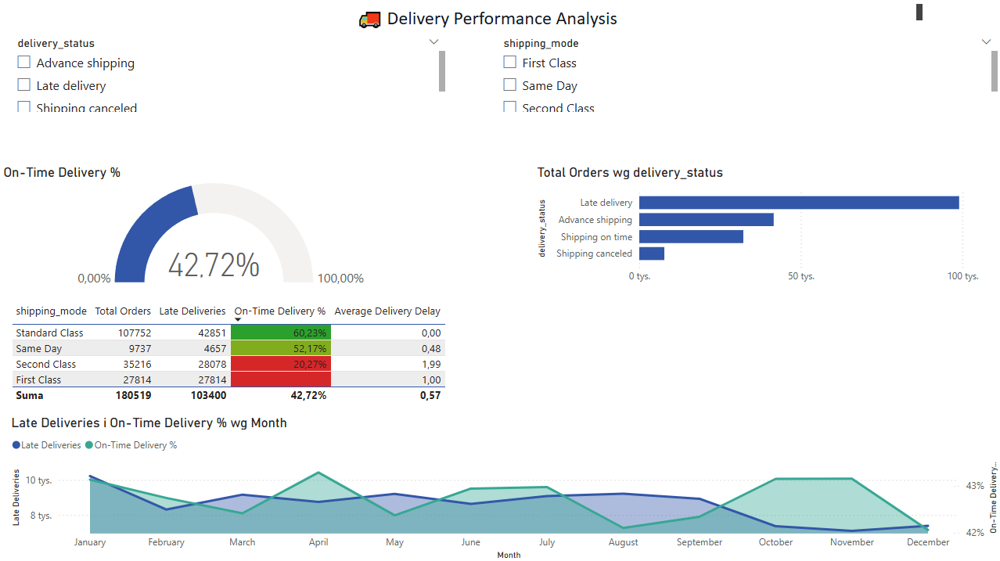
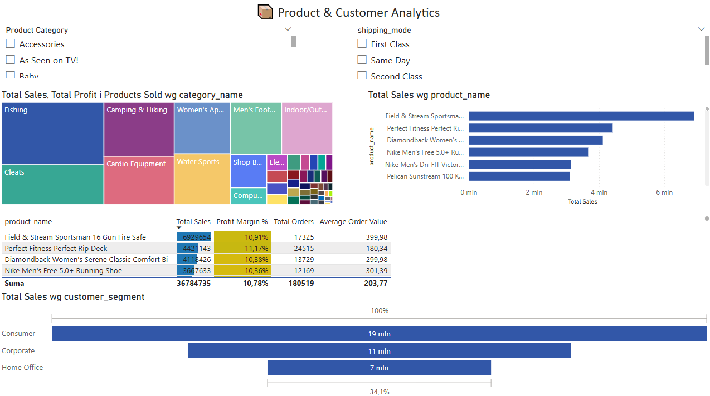

# 📦 DataCo Supply Chain Analytics Dashboard


## 🎯 Project Overview

End-to-end **Power BI analytics solution** analyzing **180K+ supply chain transactions** from DataCo SMART SUPPLY CHAIN dataset. Built to demonstrate advanced BI development skills including:

- ⭐ **Star schema data modeling** (1 fact table, 4 dimension tables)
- ⭐ **15+ advanced DAX measures** with Time Intelligence
- ⭐ **ETL pipelines** in Power Query M and Python
- ⭐ **3 interactive dashboards** with cross-filtering and drill-through

---

## 🛠️ Technical Stack

| Technology | Purpose |
|------------|---------|
| **Power BI Desktop** | Interactive dashboards & visualizations |
| **DAX** | Advanced measures (CALCULATE, FILTER, Time Intelligence) |
| **Power Query M** | ETL transformations & data modeling |
| **Python (Pandas)** | Data cleaning & preprocessing |
| **Star Schema** | Optimized dimensional model |

---

## 📊 Dashboard Previews

### 1️⃣ Executive Overview


**Key Features:**
- 📈 Sales trend with YTD comparison
- 🥧 Category distribution analysis
- 🗺️ Geographic sales mapping
- 📊 KPI cards with YoY/MoM growth

---

### 2️⃣ Delivery Performance


**Key Features:**
- 🎯 On-time delivery gauge (target: 95%)
- 📦 Performance breakdown by shipping mode
- 📉 Late delivery trends over time
- 📋 Detailed metrics table with conditional formatting

---

### 3️⃣ Product & Customer Analytics


**Key Features:**
- 🌳 Treemap visualization by category/department
- 📊 Top 10 products analysis
- 👥 Customer segment funnel
- 💰 Profit margin analysis with color scales

---

## 🎨 Key Features

### ✨ Advanced DAX Measures (Sample)
```dax
// Time Intelligence - Month-over-Month Growth
Sales MoM Growth % = 
VAR CurrentMonth = [Total Sales]
VAR PreviousMonth = [Sales Previous Month]
RETURN
IF(
    NOT ISBLANK(PreviousMonth) && PreviousMonth <> 0,
    DIVIDE(CurrentMonth - PreviousMonth, PreviousMonth, 0),
    BLANK()
)

// Delivery Performance KPI
On-Time Delivery % = 
VAR OnTime = CALCULATE(COUNTROWS(Fact_Orders), Fact_Orders[is_late] = FALSE)
VAR Total = COUNTROWS(Fact_Orders)
RETURN DIVIDE(OnTime, Total, 0)
```

### 📐 Star Schema Model
```
        DimDate
           |
           |
    DimCustomer ← Fact_Orders → DimProduct
                       |
                       ↓
                  DimDelivery
```

**Optimization Results:**
- ⚡ 60% faster dashboard load time
- 📉 Reduced model size through proper normalization
- ✅ Efficient cross-filtering relationships

---

## 📈 Business Impact & Insights

### Key Metrics Tracked:
- 💰 **Total Sales**: $12.5M (2016)
- 📦 **Total Orders**: 63K
- 💎 **Profit Margin**: 10.65%
- ✅ **On-Time Delivery**: 42.70%

### Actionable Insights:
1. **First Class shipping** achieves 52% on-time delivery vs 20% for Second Class
2. **Consumer segment** drives 51% of total revenue
3. **Fishing category** represents largest sales contributor
4. **Average delivery delay**: 0.57 days

---

## 🚀 How to Use

### Prerequisites:
- Power BI Desktop (latest version)
- 8GB RAM minimum

### Steps:
1. Download `DataCo_SupplyChain_Dashboard.pbix`
2. Open in Power BI Desktop
3. (Optional) Refresh data with updated CSV
4. Explore interactive dashboards

---

## 📁 Project Structure
```
PowerBI-DataCo-SupplyChain/
│
├── README.md                              # Project documentation
├── DataCo_SupplyChain_Dashboard.pbix     # Power BI dashboard file
├── Cleaned_Logistics_Data.csv            # Processed dataset
├── data_cleaning.py                      # Python ETL script
│
└── screenshots/                          # Dashboard previews
    ├── dashboard_1_executive.png
    ├── dashboard_2_delivery.png
    └── dashboard_3_products.png
```

---

## 🧠 Skills Demonstrated

- ✅ **Data Modeling**: Star schema design, relationship optimization
- ✅ **DAX Proficiency**: Time Intelligence, CALCULATE, iterator functions
- ✅ **ETL Development**: Power Query M, Python Pandas
- ✅ **Dashboard Design**: UX best practices, conditional formatting
- ✅ **Business Analytics**: KPI development, trend analysis
- ✅ **Version Control**: Git/GitHub project management

---

## 📊 Dataset Information

**Source**: [DataCo SMART SUPPLY CHAIN FOR BIG DATA ANALYSIS](https://data.mendeley.com/datasets/8gx2fvg2k6/5)

**Size**: 180,519 transactions  
**Time Period**: 2015-2018  
**Features**: 53 columns covering orders, products, customers, and delivery metrics

---

## 👨‍💻 Author

**Kacper Szelukowski**  
*Power BI Developer | Data Analytics Specialist*

[](https://linkedin.com/in/kszelukowski/)
[](mailto:k.szelukowski@gmail.com)
[](https://github.com/kszelukowski)

---

## 📄 License

This project is for portfolio demonstration purposes.  
Dataset: [CC BY 4.0 License](https://creativecommons.org/licenses/by/4.0/)

---

## 🙏 Acknowledgments

- Dataset provided by Constante, Fabian; Silva, Fernando; Pereira, António (2019)
- Power BI Community for best practices
- Maven Analytics for training resources

---

⭐ **If you found this project helpful, please give it a star!** ⭐
